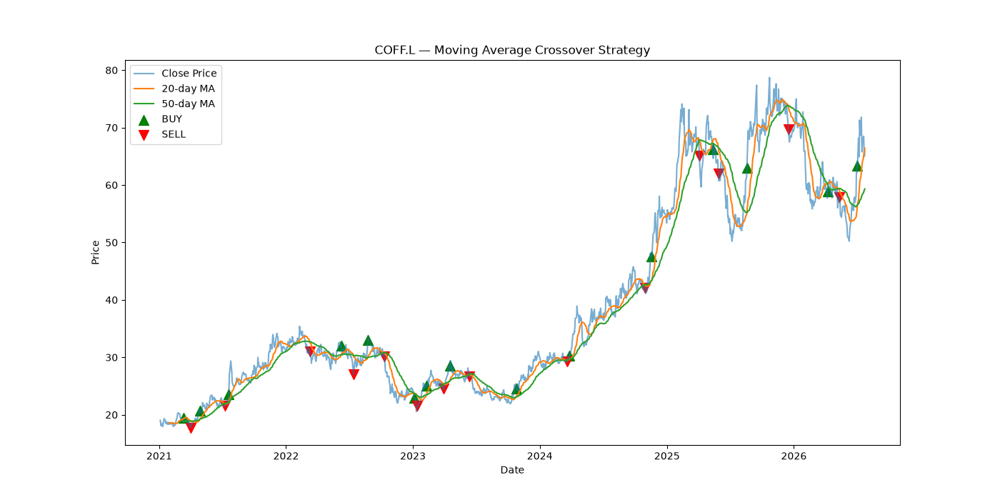
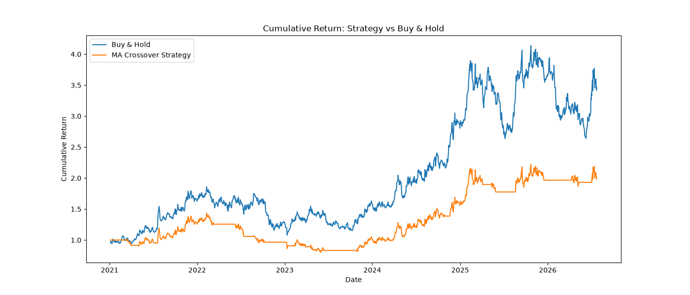

# TRADING ALGORITHM COFF.L

## Team
-Inna Tomashevska

-Myroslava Lytvyn

## The Idea
In this project we work on a trading strategy based on Moving Average Crossover method.
We chose coffee because it is wildly popular among students, programmers, economists (who we are), milenials, and many other people. Overall the demand for coffee is extremely inelastic because of coffee addiction which is very common. 
Its price is influenced by global supply and demand, weather conditions, harvest volumes, and delivery costs. This is why we thought `COFF.L` would be interesting to analyze from economical point of view. 

## Tools and Data
Historical data is downloaded using `yfinance`.

Libraries we used:
- `pandas` for DataFrame creation and analysis;
- `matplotlib` for visualisation

The initial dataset includes open, high, low, close, and volume values from 2021 to 2026.
We also removed rows with missing values using `dropna()`.
## Trading strategy

We used two moving averages:

- a 20-day moving average;
- a 50-day moving average.

The algorithm gives a `BUY` signal when the 20-day average crosses above the 50-day average.

It gives a `SELL` signal when the 20-day average crosses below the 50-day average.

In all other cases, the signal is `HOLD`.

## Results

We tested the strategy with an initial investment of `$1000`.

Results:

- Buy & Hold return: `246.30%`;
- Strategy return: `101.01%`;
- Buy & Hold final value: `$3463.02`;
- Strategy final value: `$2010.09`;
- Buy & Hold profit: `$2463.02`;
- Strategy profit: `$1010.09`.

We also created two graphs. The first graph shows the price, moving averages, and BUY/SELL points. The second graph compares the results of our strategy with Buy & Hold.

## Conclusion

Our strategy made a profit, so it worked. However, Buy & Hold gave a much better result.

The main reason is that moving averages react to price changes with some delay. Because of this, the strategy sometimes bought or sold too late and missed part of the price growth.

So, for `COFF.L` during this period, simply buying and holding the instrument was more effective than our Moving Average Crossover strategy.